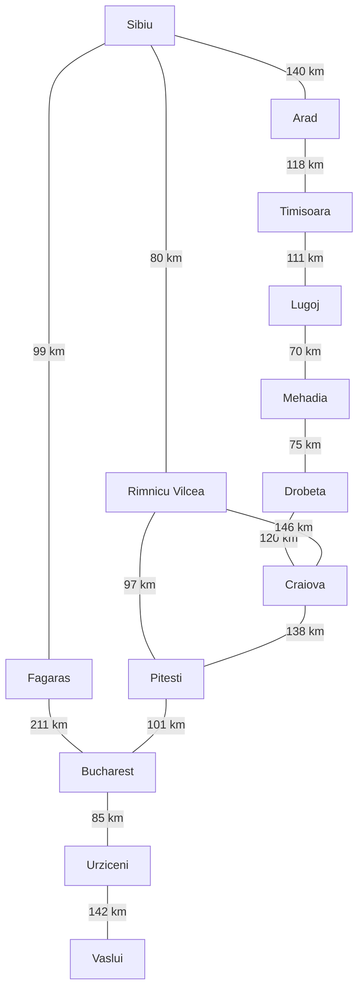
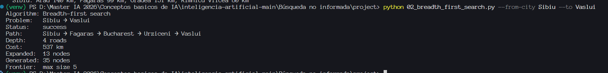

# Ejercicio 1 — Comparación de BFS, UCS, DFS, DLS e IDS

## 1. Instancia seleccionada

**Origen:** Sibiu.

**Destino:** Vaslui.

## 2. Caminos obtenidos

| Identificador | Camino |
| --- | --- |
| A | Sibiu → Fagaras → Bucharest → Urziceni → Vaslui |
| B | Sibiu → Rimnicu Vilcea → Pitesti → Bucharest → Urziceni → Vaslui |
| C | Sibiu → Arad → Timisoara → Lugoj → Mehadia → Drobeta → Craiova → Pitesti → Bucharest → Urziceni → Vaslui |

## 3. Tabla comparativa

| Algoritmo | Límite | Status | Path | Depth (carreteras) | Cost (km) | Expanded | Generated | Frontera máxima |
| --- | --- | --- | --- | --- | --- | --- | --- | --- |
| BFS | No aplica | success | A | 4 | 537 | 13 | 35 | 5 |
| UCS | No aplica | success | B | 5 | 505 | 16 | 41 | 6 |
| DFS | No aplica | success | C | 10 | 1100 | 13 | 33 | 6 |
| DLS | 2 | cutoff | Sin solución devuelta | — | — | 5 | 15 | 5 |
| DLS | 3 | cutoff | Sin solución devuelta | — | — | 11 | 31 | 7 |
| DLS | 4 | success | A | 4 | 537 | 11 | 26 | 7 |
| IDS | Último límite: 4 | success | A | 4 | 537 | 28 | 78 | 7 |

## 4. Subgrafo relevante

El siguiente subgrafo reúne todas las ciudades que aparecen en los caminos A, B y C y las carreteras del mapa estándar entre ellas. Las conexiones son bidireccionales y las etiquetas indican kilómetros. No representa todas las ciudades exploradas por los algoritmos.

### Comprobación de costos

- **A — BFS, DLS con límite 4 e IDS:** 99 + 211 + 85 + 142 = **537 km**, con **4 carreteras**.
- **B — UCS:** 80 + 97 + 101 + 85 + 142 = **505 km**, con **5 carreteras**.
- **C — DFS:** 140 + 118 + 111 + 70 + 75 + 120 + 138 + 101 + 85 + 142 = **1100 km**, con **10 carreteras**.

## 5. Reporte de análisis

Para la instancia Sibiu → Vaslui, BFS encontró un camino de cuatro carreteras y 537 km. Este es óptimo en profundidad porque BFS explora los estados por niveles y encuentra una solución con el menor número de aristas. UCS devolvió un camino diferente, de cinco carreteras y 505 km. Al priorizar el costo acumulado y trabajar con distancias positivas, UCS encuentra el camino de menor costo. Por tanto, recorrer una carretera adicional permitió ahorrar 32 km. La diferencia aparece porque las carreteras no tienen el mismo peso: minimizar su cantidad no equivale a minimizar los kilómetros.

DFS encontró un camino de diez carreteras y 1100 km. Su estrategia profundiza en una rama antes de explorar las alternativas, sin ordenar la búsqueda por distancia ni por profundidad mínima. En esta corrida, el camino solución pasó primero por Arad y continuó por Timisoara, Lugoj y otras ciudades hasta alcanzar Vaslui. El orden alfabético hace reproducible la exploración, pero no garantiza optimalidad. Aunque DFS y BFS expandieron 13 nodos cada uno, sus soluciones tuvieron costos muy diferentes.

DLS devolvió `cutoff` con límites 2 y 3 y encontró solución con límite 4. Ese es el mínimo suficiente para esta instancia, ya que coincide con la profundidad mínima obtenida por BFS. IDS también llegó a la solución al alcanzar el límite 4 y devolvió el mismo camino y costo que BFS. La coincidencia en profundidad responde a la estrategia de profundización iterativa.

IDS registró el mayor número de expansiones, 28, debido a las búsquedas sucesivas con límites crecientes. UCS expandió 16 nodos frente a 13 de BFS. DLS con límite 4 expandió 11, aunque recibió directamente un límite suficiente. Los resultados muestran que la calidad de la solución y el esfuerzo de búsqueda son medidas distintas: expandir menos nodos no garantiza encontrar un camino más corto o más barato.

## 6. Reto opcional

La pareja elegida cumple el reto de obtener caminos diferentes para BFS y UCS:

| Comparación | BFS | UCS |
| --- | --- | --- |
| Carreteras | 4 | 5 |
| Costo (km) | 537 | 505 |
| Nodos expandidos | 13 | 16 |
| Nodos generados | 35 | 41 |

UCS ahorró **32 km** respecto al costo de BFS, a cambio de una carretera adicional. Según `Expanded`, UCS realizó tres expansiones más en esta instancia.

## 7. Evidencias de ejecución

### 7.1. BFS

### 7.2. UCS

### 7.3. DFS

### 7.4. DLS con límite 2

### 7.5. DLS con límite 3

### 7.6. DLS con límite 4

### 7.7. IDS

