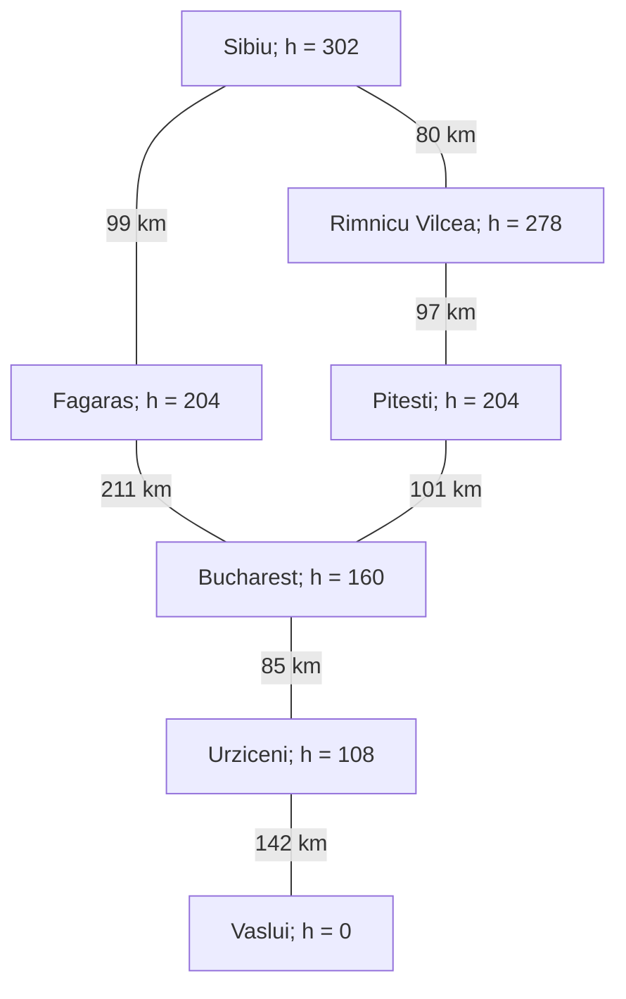
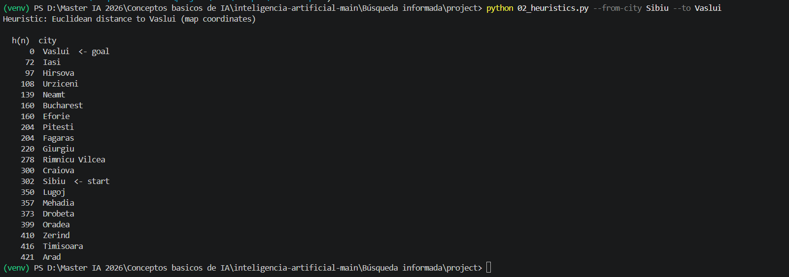

# Ejercicio 1 — Comparar Greedy y A* en el mapa de Rumania

## 1. Instancia y procedimiento

**Origen:** Sibiu.

**Destino:** Vaslui.

El programa reportó la heurística **Euclidean distance to Vaslui (map coordinates)**. Por tanto, se empleó la distancia euclidiana de las coordenadas del mapa hacia Vaslui, no la tabla AIMA hacia Bucharest. El enunciado establece que esta heurística es admisible.

- **g(n):** costo acumulado desde Sibiu hasta el nodo por el camino considerado.
- **h(n):** estimación del costo restante hasta Vaslui.
- **f(n):** suma de g(n) y h(n).

Greedy prioriza el menor h de la frontera. A* prioriza el menor f. El orden alfabético de vecinos hace reproducible la exploración según las condiciones del ejercicio.

## 2. Resultados

| Algoritmo | Status | Path | Depth (carreteras) | Cost (km) | Expanded | Generated | Frontera máxima | Heurística |
| --- | --- | --- | --- | --- | --- | --- | --- | --- |
| Greedy | success | Sibiu → Fagaras → Bucharest → Urziceni → Vaslui | 4 | 537 | 4 | 14 | 7 | Euclidiana hacia Vaslui |
| A* | success | Sibiu → Rimnicu Vilcea → Pitesti → Bucharest → Urziceni → Vaslui | 5 | 505 | 6 | 20 | 6 | Euclidiana hacia Vaslui |

### 2.1. Valores del camino de Greedy

| Ciudad | g | h | f = g + h |
| --- | --- | --- | --- |
| Sibiu | 0 | 302 | 302 |
| Fagaras | 99 | 204 | 303 |
| Bucharest | 310 | 160 | 470 |
| Urziceni | 395 | 108 | 503 |
| Vaslui | 537 | 0 | 537 |

### 2.2. Valores del camino de A*

| Ciudad | g | h | f = g + h |
| --- | --- | --- | --- |
| Sibiu | 0 | 302 | 302 |
| Rimnicu Vilcea | 80 | 278 | 358 |
| Pitesti | 177 | 204 | 381 |
| Bucharest | 278 | 160 | 438 |
| Urziceni | 363 | 108 | 471 |
| Vaslui | 505 | 0 | 505 |

## 3. Subgrafo relevante

Se incluyen las ciudades de los dos caminos obtenidos. Las carreteras son bidireccionales, las aristas muestran kilómetros y cada nodo indica su heurística hacia Vaslui.



Tabla equivalente para visores sin soporte de Mermaid:

| Ciudad 1 | h de ciudad 1 | Ciudad 2 | h de ciudad 2 | Carretera (km) |
| --- | --- | --- | --- | --- |
| Sibiu | 302 | Fagaras | 204 | 99 |
| Sibiu | 302 | Rimnicu Vilcea | 278 | 80 |
| Fagaras | 204 | Bucharest | 160 | 211 |
| Rimnicu Vilcea | 278 | Pitesti | 204 | 97 |
| Pitesti | 204 | Bucharest | 160 | 101 |
| Bucharest | 160 | Urziceni | 108 | 85 |
| Urziceni | 108 | Vaslui | 0 | 142 |
- Greedy: 99 + 211 + 85 + 142 = **537 km**.
- A*: 80 + 97 + 101 + 85 + 142 = **505 km**.

## 4. Explicación de un punto de decisión

La siguiente comparación reconstruye las decisiones a partir de las aristas, las heurísticas impresas y las reglas de prioridad. No es una traza de expansión emitida por los programas. Los números utilizados son los valores mostrados en las salidas.

### 4.1. Al expandir Sibiu

| Vecino | g desde Sibiu | h hacia Vaslui | f |
| --- | --- | --- | --- |
| Arad | 140 | 421 | 561 |
| Fagaras | 99 | 204 | 303 |
| Oradea | 151 | 399 | 550 |
| Rimnicu Vilcea | 80 | 278 | 358 |

Ambos criterios favorecen inicialmente a **Fagaras**: tiene el menor h y también el menor f entre los vecinos del origen. Que Fagaras no aparezca en el camino final de A* no significa que A* no la haya expandido.

### 4.2. Después de expandir Fagaras

Aparece la posibilidad de llegar a Bucharest mediante Fagaras, con g = 99 + 211 = 310. Rimnicu Vilcea permanece pendiente en la frontera.

| Candidato pendiente | g | h | f |
| --- | --- | --- | --- |
| Bucharest, mediante Fagaras | 310 | 160 | 470 |
| Rimnicu Vilcea, desde Sibiu | 80 | 278 | 358 |

**Greedy favorece Bucharest**, porque 160 < 278. **A* favorece Rimnicu Vilcea**, porque 358 < 470. Los otros candidatos pendientes del primer paso, Arad y Oradea, tienen prioridades mayores en ambas comparaciones.

Desde Rimnicu Vilcea, A* puede alcanzar Pitesti con g = 80 + 97 = 177 y f = 177 + 204 = 381. A través de Pitesti encuentra una llegada más barata a Bucharest: g = 177 + 101 = **278**, frente a **310** por Fagaras. Esta mejora de **32 km** se conserva en el costo total porque ambos caminos comparten el tramo Bucharest → Urziceni → Vaslui.

## 5. Reporte de análisis

En la instancia Sibiu → Vaslui, Greedy y A* devolvieron caminos diferentes. Greedy encontró una ruta de cuatro carreteras y 537 km, mientras que A* obtuvo una de cinco carreteras y 505 km. A* encontró el camino de menor costo, resultado que también coincide con los 505 km obtenidos por UCS para la misma pareja en el ejercicio de búsqueda no informada. La ruta con menos carreteras no fue la más barata.

Ambos algoritmos utilizaron la heurística euclidiana hacia Vaslui. Greedy prioriza únicamente h, por lo que favorece ciudades que parecen próximas al destino sin considerar cuánto ha costado llegar a ellas. Incluso si h es admisible, esa regla no garantiza un camino óptimo: una estimación que no sobreestima el costo restante no compensa que se ignore el costo ya acumulado. A* incorpora ambos componentes mediante f = g + h.

La diferencia se observa después de explorar Fagaras. Greedy prefiere Bucharest por su h de 160, menor que el 278 de Rimnicu Vilcea. A*, en cambio, puede priorizar Rimnicu Vilcea porque su f es 358, inferior al 470 de Bucharest alcanzada por Fagaras. Esto permite descubrir la alternativa por Pitesti y reducir el costo acumulado de llegada a Bucharest de 310 a 278 km.

En el camino final de A*, f toma los valores 302, 358, 381, 438, 471 y 505: no disminuye. Este comportamiento concuerda con una heurística consistente, cuya estimación satisface h(n) ≤ c(n,n’) + h(n’) en cada transición. La secuencia observada es compatible con esa propiedad, aunque por sí sola no demuestra consistencia en todo el grafo. A* expandió seis nodos y Greedy cuatro; en esta corrida, el mayor número de expansiones de A* estuvo acompañado por una solución 32 km más barata.

## 6. Relación entre consistencia y f

Si un sucesor n’ se alcanza desde n con costo de carretera c, entonces:

```
g(n') = g(n) + c
h(n) ≤ c + h(n')                     [consistencia]
g(n) + h(n) ≤ g(n) + c + h(n')
f(n) ≤ f(n')
```

En las transiciones del camino final de A*, los valores impresos cumplen:

| Transición | Comprobación h(n) ≤ c + h(n’) |
| --- | --- |
| Sibiu → Rimnicu Vilcea | 302 ≤ 80 + 278 = 358 |
| Rimnicu Vilcea → Pitesti | 278 ≤ 97 + 204 = 301 |
| Pitesti → Bucharest | 204 ≤ 101 + 160 = 261 |
| Bucharest → Urziceni | 160 ≤ 85 + 108 = 193 |
| Urziceni → Vaslui | 108 ≤ 142 + 0 = 142 |

La admisibilidad exige no sobreestimar el costo real restante. La consistencia exige además la desigualdad local anterior. Esta comprobación se limita a las transiciones mostradas, no a todas las aristas del mapa.

## 7. Reto opcional: comparación con UCS

Se reutiliza la ejecución de UCS realizada en el ejercicio anterior para la misma pareja Sibiu → Vaslui.

| Algoritmo | Camino | Cost (km) | Depth | Expanded | Generated |
| --- | --- | --- | --- | --- | --- |
| Greedy | Sibiu → Fagaras → Bucharest → Urziceni → Vaslui | 537 | 4 | 4 | 14 |
| A* | Sibiu → Rimnicu Vilcea → Pitesti → Bucharest → Urziceni → Vaslui | 505 | 5 | 6 | 20 |
| UCS | Sibiu → Rimnicu Vilcea → Pitesti → Bucharest → Urziceni → Vaslui | 505 | 5 | 16 | 41 |

A* y UCS coincidieron en camino y costo. Los programas reportaron seis expansiones para A* y dieciséis para UCS. Esta comparación de contadores es descriptiva y depende de sus convenciones de instrumentación; no constituye una medición de tiempo. La pareja también cumple el reto de mostrar discrepancia entre Greedy y A*.

## 8. Evidencias de ejecución

Las siguientes transcripciones conservan los comandos y resultados visibles en las capturas proporcionadas. Se omite el prefijo de PowerShell con la ruta local y se normalizan los espacios. Así, el documento contiene las evidencias sin depender de imágenes externas.

### 8.1. Listado de heurísticas



### 8.2. Greedy best-first


### 8.3. A*


### 8.4. UCS — evidencia reutilizada del ejercicio anterior

Ejecutado en `Búsqueda no informada/project`:

